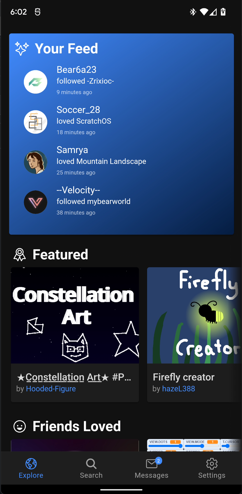

# itchy-ionic
A hybrid-native approach to a Scratch mobile app built with the Ionic framework

[](https://github.com/Scratch-Client-4/itchy-ionic/actions/workflows/android-debug.yml)



## Developing

### Prerequisites

- `itchy-ionic` is built with Ionic Vue, which means you'll need to understand [Ionic](https://ionicframework.com/docs/vue/overview) and [Vue.js](https://vuejs.org) as well as [Capacitor](https://capacitorjs.com/) if you're building the app for Android.

### Process

Before adding new features, check the [issues page](https://github.com/scratch-client-4/itchy-ionic) to make sure there are no issues you can fix. While developing new features and/or components, please make sure that your code is as modularized and is as reusable as possible.

### Capacitor Live Reload

Capacitor provides a very handy hot-reload function that combines the best parts of a native Capacitor app and the Vue CLI's native hot-reload tool. We've aliased this functionality with the following script:

```bash
npm run dev
```

## Building for platforms

### Requirements

- A properly set-up installation of [Android Studio](https://developer.android.com/studio)
- [Git](https://git-scm.com/)
- [NPM](https://www.npmjs.com/)
- [Node.js](https://nodejs.org/)

### Building for android

First, clone the repository:
`git clone https://github.com/Scratch-Client-4/itchy-ionic.git`
Then go into it and install all dependencies:

```bash
cd itchy-ionic
npm install
```

Then run the build script:

```bash
npm run production
```

To run on an emulator, press the "Play" icon in the top toolbar or use `Shift+F10`.

To build APK's for production, open the "Build" menu, hover over "Build Bundle(s) / APK(s)", and select "Build APK(s)".

## Building assets

As a mobile app, there are several assets that are required to be built for different screen sizes. All asset builds use `cordova-res`, which you can install with:

```bash
npm install -g cordova-res
```

### Generating icons

Itchy uses the new standard of [Android Adaptive Icons](https://developer.android.com/guide/practices/ui_guidelines/icon_design_adaptive), which means that any icon updates must:

- Be high-resolution
- Be made up of foreground and background components
- Fit the size limits of adaptive icons outlined in the [requirements](https://developer.android.com/guide/practices/ui_guidelines/icon_design_adaptive)

Building icons is as simple as this:

```bash
cordova-res --type adaptive-icon
cordova-res --type icon
```

The icons are placed in `./resources/android/icon` where they can be referenced by the `config.xml` file.

### Generating splash screens

The splash screen displays when the app is opened but still loading. It must be simple and also follow the [Cordova splashscreen guidelines](https://cordova.apache.org/docs/en/latest/reference/cordova-plugin-splashscreen/). Splash generation is slightly tricky since we have to build for both light and dark mode. Light mode is easy enough:

```bash
cordova-res --type splash
```

However, dark mode is not explicitly supported by `cordova-res`, so the team created a custom build script for dark splashes, which **must** be run from the root of the project:

```bash
npm run-script genDarkSplashes
```

Take note that this script is _only designed for Unix-based operating systems_ such as Mac and Linux. The [forward slashes will break the script on Windows](https://www.howtogeek.com/181774/why-windows-uses-backslashes-and-everything-else-uses-forward-slashes/). The easiest way to get around this when trying to build on Windows is to temporarily replace the forward slashes (`/`) with escaped backslashes (`\\`).
